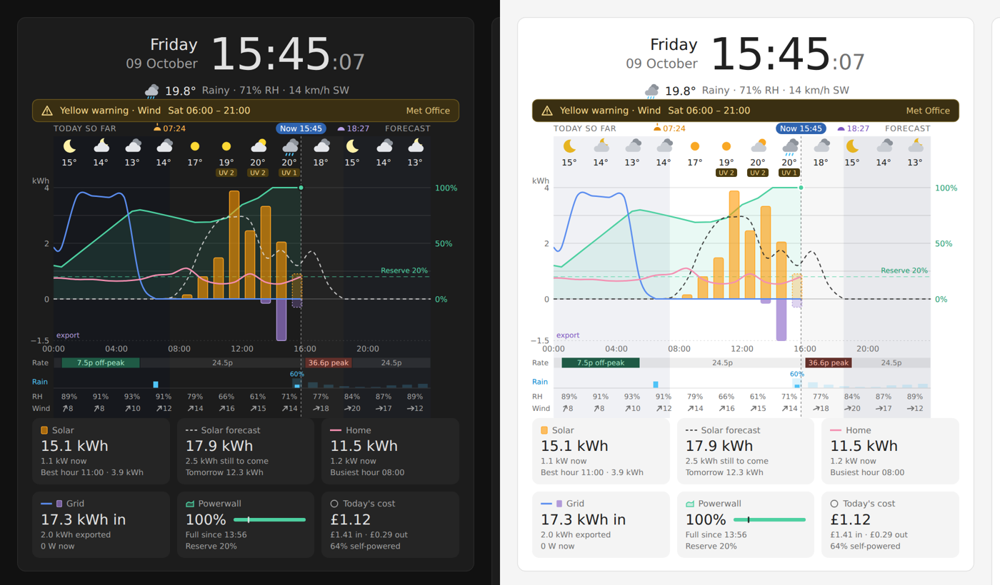

# Energy & Weather Timeline Card

A Home Assistant dashboard card with:

- a clock
- current weather, a weather-warning banner and a red storm alert
- one sliding timeline with now always in the centre, joining yesterday, today and tomorrow: hourly weather, solar production and forecast, home use, grid import/export, battery charge with backup reserve, import and export tariff periods, rain, humidity and UV
- six summary tiles underneath, including the battery's time left and today's import cost and export income

It was built and checked against Home Assistant 2026.10. It is a single file with no external downloads, so it works offline and in the Companion app.



## Install with HACS

[](https://my.home-assistant.io/redirect/hacs_repository/?owner=sencercoltu&repository=energy-weather-timeline-card&category=plugin)

Or add it by hand:

1. Open **HACS → ⋮ → Custom repositories**.
2. Repository: `https://github.com/sencercoltu/energy-weather-timeline-card`. Type: **Dashboard**.
3. Search HACS for **Energy & Weather Timeline Card**, open it and select **Download**.
4. Reload the browser.

HACS registers the dashboard resource for you and offers future releases as updates.

## Install manually

1. Copy `dist/energy-weather-timeline-card.js` to `/config/www/`.
2. Go to **Settings → Dashboards → ⋮ → Resources → Add resource**.
   - URL: `/local/energy-weather-timeline-card.js`
   - Type: **JavaScript module**
3. Hard-refresh the browser.

After either install, edit a dashboard → **Add card** → **Energy & Weather Timeline**.

## Visual editor

Every option is in the card editor, grouped into **Clock and weather**, **Solar**, **Home and grid**, **Battery**, **Tariff and cost** and **Show or hide**. Leave out any entity you don't have, and the parts of the card that need it will hide themselves.

The tariff periods use a small YAML box inside the editor:

```yaml
- start: "00:30"
  end: "05:30"
  rate: 0.075
  type: off_peak
- start: "16:00"
  end: "19:00"
  rate: 0.366
  type: peak
```

`type` is `off_peak`, `standard` or `peak`. Any hour not listed uses **Standard import rate**. Rates are in your currency per kWh, so 0.245 means 24.5p. An optional `label:` replaces the default "off-peak" or "peak" text.

**Import price entity.** If your import price lives in its own entity (for example Octopus Energy's *current rate* sensor or its *current day rates* event), pick it under **Tariff and cost** instead of listing periods. It is read the same way as the export price entity below and drawn as the **Buy** band. With neither periods nor an entity, the **Standard import rate** alone still gives a flat Buy band.

**Export tariff periods** use the same format with your export rates, for example a peak export window:

```yaml
- start: "16:00"
  end: "19:00"
  rate: 0.29
  type: peak
```

Any hour not listed uses **Standard export rate**. When export periods are set, the timeline shows two bands, **Buy** and **Sell**. Leave them out if your export rate is flat; the flat rate is still used for today's income.

**Export price entity.** If your export price lives in its own entity, pick it under **Tariff and cost**; it takes priority over the export periods. Past hours come from its recorded history. Upcoming hours come from a list of rates in its attributes, if it has one, for example Octopus Energy's *export current day rates* event or Nord Pool's `raw_today` / `raw_tomorrow`. Without such a list, the Sell band stops after the current rate period. Units such as GBP/kWh and p/kWh are converted, and the browser console (F12) says which parts of the entity were used.

**Timeline length** (under **Show or hide**) is 24, 36 or 48 hours, with now always in the centre. The past half comes from your history, reaching back into yesterday; the future half comes from the weather and solar forecasts, reaching into tomorrow. Each midnight is marked with the day's name. The blue **Now** label and every sunrise and sunset in view are marked at the top; a sunrise or sunset next to now moves beside the label instead of hiding under it.

## What each entity needs

- **Energy sensors** (solar, home, grid import, grid export, rain gauge) are cumulative meters, the same ones the Energy dashboard uses. The card reads their hourly statistics. A sensor without statistics (no `state_class`) is read from the recorder history instead. If an energy sensor is missing, or shows no change today while the matching power sensor shows a flow, the card integrates that power sensor over the day instead; for grid power, positive counts as import and negative as export. The browser console (F12) says which source each flow came from.
- **Battery state of charge, weather and the import and export price entities** are read from the recorder history.
- **Weather** must support hourly forecasts. The card subscribes to them, so the forecast hours update live.
- **Solar forecast**: pick a *forecast today* sensor whose attributes hold the hour-by-hour (or half-hourly, 15-minute) forecast, as Solcast and Open-Meteo Solar Forecast do. The card finds the series in the attributes whatever its layout and works out the unit by matching the sensor's daily total. If you leave the entity empty, or it has no such attributes, the card uses the forecast linked to your solar panels in the Energy dashboard. The browser console (F12) shows one line saying which source it used, or why it found none.
- **Power sign conventions**:
  - Grid power: positive = importing.
  - Battery power: positive = discharging. This is the Powerwall/pypowerwall convention.
  - If yours are the other way round, use the invert toggles.
- **Weather warning**: any entity that is `on` (or carries a `warnings` list) while a warning is active, for example a MeteoAlarm binary sensor. The headline, severity colour and start/end times are read from its attributes.

## Example (YAML mode)

The entity IDs below are placeholders; pick yours in the editor.

```yaml
type: custom:energy-weather-timeline-card
weather_entity: weather.home
warning_entity: binary_sensor.meteoalarm
solar_energy_entity: sensor.powerwall_solar_energy
solar_power_entity: sensor.powerwall_solar_power
solar_forecast_tomorrow_entity: sensor.energy_production_tomorrow
home_energy_entity: sensor.powerwall_home_energy
home_power_entity: sensor.powerwall_load_power
grid_import_entity: sensor.powerwall_grid_import
grid_export_entity: sensor.powerwall_grid_export
grid_power_entity: sensor.powerwall_site_power
battery_name: Powerwall
battery_soc_entity: sensor.powerwall_charge
battery_unit_soc_entities:   # optional: main battery first, then expansions
  - sensor.powerwall_battery_1_charge
  - sensor.powerwall_battery_2_charge
battery_power_entity: sensor.powerwall_battery_power
battery_capacity: 27
battery_reserve: 20
tariff:
  - { start: "00:30", end: "05:30", rate: 0.075, type: off_peak }
  - { start: "16:00", end: "19:00", rate: 0.366, type: peak }
standard_rate: 0.245
export_rate: 0.15
export_tariff:
  - { start: "16:00", end: "19:00", rate: 0.29, type: peak }
# or, instead of export_tariff, an entity with your export price:
# export_rate_entity: event.octopus_energy_electricity_xxxx_export_current_day_rates
timeline_hours: "24"
```

## Good to know

- **Time zone.** The clock and the timeline follow the time zone in your Home Assistant profile, not the device's. You can set a fixed `time_zone` instead.
- **Cost and income are approximate.** Both are worked out per hour: price entities at the average of the hour's two half hours, tariff periods at the rate in force at the middle of the hour. A tariff period that changes on a half hour (00:30, 05:30) will be a few pence off your bill. The money tile shows the net amount ("Net cost", or "Net earnings" in green when export income is larger), then what you bought and sold, with a bar splitting the two, and the self-powered share.
- **Self-powered %** is the share of home use not covered directly by grid import in each hour. That's close to how the Tesla app reports it.
- **The running hour** is shown dashed. Its value comes from the live meter reading, so it updates as you watch.
- **Battery tile.** The big number and the bar are the total charge. If you pick **Each battery's state of charge** (main battery first, then each expansion), each battery gets a thin line under the bar with its percentage; hover for the names. The bar and lines share one colour scale (red up to the backup reserve, yellow to 60 %, green to 100 %), and the reserve mark runs through all of them. Without a total charge entity, the average of the batteries is shown.
- **Battery time left** needs **Usable battery capacity**. Discharging: time until the backup reserve, and the clock time. Charging: time until full. Idle or full: how long it would last at the current home use. Anything over two days shows as "2+ days".
- **Storm alert.** A red label appears when the hourly forecast for the next 24 hours has thunder, hail or exceptional weather, or gusts of 75 km/h (or a mean wind of 55 km/h) and above. The affected hours are marked red on the timeline. Turn it off with **Storm alert** under **Show or hide**.
- **Light themes** are supported; the card switches its night shading and icon colours automatically.
- **Sections view.** The card starts at 12 columns × 12 rows and fits whatever size you give it in the card's **Layout** tab (at least 6 columns × 7 rows). The graph grows or shrinks to fill the space; when space is tight, the humidity row, rain lane, tariff bands, summary tiles and weather icons are left out, in that order. In other views the card is as tall as its content.
- **Today only.** The summary tiles (solar, home, grid, cost and income, self-powered %) always count from midnight to now. Only the graph reaches into yesterday and tomorrow.
- **Large totals.** Energy totals of 1000 kWh and above are shown in MWh with two decimals.
- **Axis.** The kWh axis counts in round steps (0.5, 1, 2, 5, 10 … kWh), as many as the graph's height has room for.
- **Impossible hours.** A home can't use or produce more than 100 kWh in an hour. When a fifth or more of an energy sensor's hours read above that, its values are taken as Wh and divided by 1000. A single hour above it is a meter that dropped to zero and came back, so it is left out. Either way the browser console (F12) names the sensor and the hours.
- **Versions.** The version is shown in the card picker and in the browser console. In the GitHub repo, changing `CARD_VERSION` and pushing publishes a matching release automatically, which HACS then offers as an update.
